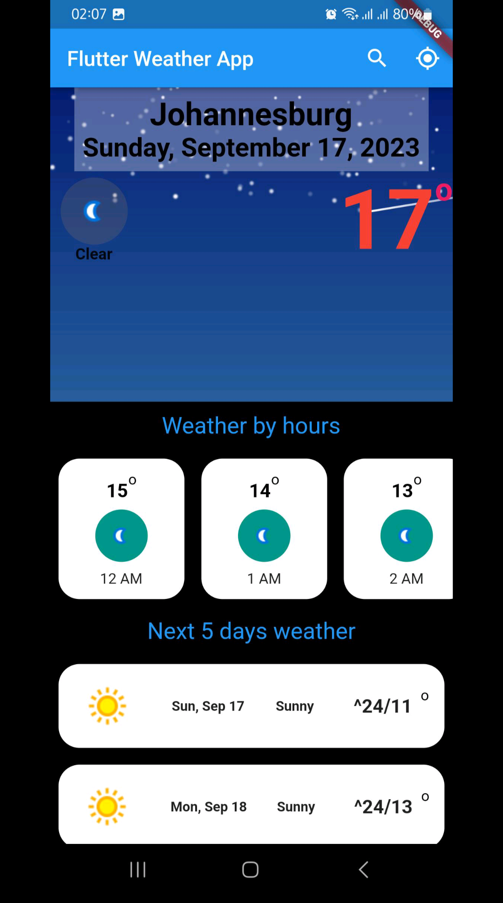

# Weather App

## 📌 Overview
The **Weather App** is a Flutter-based mobile application that provides real-time weather updates for users based on their location. The app integrates a weather API to fetch and display accurate weather conditions, forecasts, and additional details such as humidity, wind speed, and temperature variations.

## 🚀 Features
- 🌍 **Location-based Weather Updates** (Uses GPS to fetch real-time weather conditions)
- 🔍 **Search Functionality** (Check the weather of any city worldwide)
- ⛅ **5-Day Weather Forecast** (Displays future weather trends)
- 🔄 **Real-time Data Fetching** (Live updates from the weather API)
- 📊 **Detailed Weather Information** (Temperature, humidity, wind speed, and more)

## 🖥 Tech Stack
- **Frontend:** Flutter, Dart
- **API Integration:** OpenWeather API (or similar weather API)
- **State Management:** Provider /GetX
- **Other Tools:** Git, REST API, Firebase (optional for additional features)

## 📸 Screenshots


## 🛠 Setup & Installation
1. Clone the repository:
   ```sh
   git clone https://github.com/sbfrusho/Weather-App.git
   cd Weather-App
   ```
2. Install dependencies:
   ```sh
   flutter pub get
   ```
3. Get a free API key from OpenWeather (or any other weather service) and add it to the project:
   - Open `lib/constants.dart`
   - Replace `YOUR_API_KEY_HERE` with your actual API key
4. Run the app:
   ```sh
   flutter run
   ```

## 💡 Challenges & Solutions
### 🌐 Handling API Rate Limits
- **Issue:** Too many API calls causing rate limit issues.
- **Solution:** Implemented caching to reduce redundant requests and optimize API usage.

### 🔋 Battery Optimization
- **Issue:** Constant GPS tracking consumes battery quickly.
- **Solution:** Used location tracking efficiently by reducing unnecessary background updates.

### ⚡ Smooth UI Performance
- **Issue:** API responses taking time, leading to laggy UI.
- **Solution:** Implemented loading indicators and optimized API response handling with asynchronous calls.

## 👨‍💻 Author
Developed by **Sakib Bin Faruque Rusho**

📧 Contact: [rushocseru28@gmail.com](mailto:rushocseru28@gmail.com)

🔗 GitHub: [sbfrusho](https://github.com/sbfrusho)

Feel free to contribute and report any issues! 🚀
